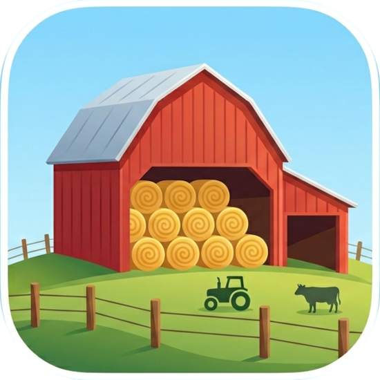
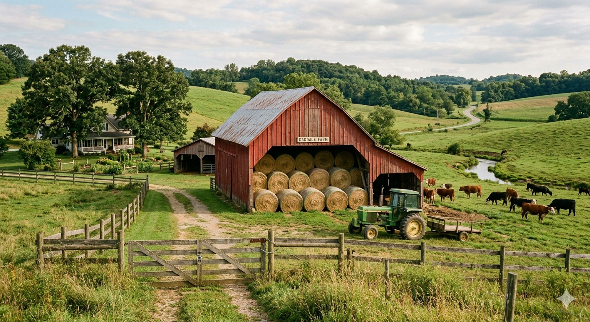

<div align="center">



# Haybarn

**An independent derived distribution of DuckDB.**
*Same engine. Your own signing keys, supply chain, and release cadence.*
*Powered by DuckDB. Published by [Query Farm LLC](https://query.farm).*



**[Why Haybarn?](#why-haybarn) · [What's in here](#whats-in-here) · [Releases](#releases) · [Switching from DuckDB](#switching-from-duckdb) · [Live status ↗](https://haybarn-status.query.farm)**

</div>

---

**Try it in ten seconds — nothing to install:**

```sh
npx haybarn@rc -c "SELECT 'hello from the barn' AS greeting;"
```

> [!NOTE]
> Haybarn runs on the **stable, ABI-frozen DuckDB v1.5.5 engine** — your
> `.duckdb` files and SQL work unchanged. Every registry currently carries the
> `haybarn-v1.5.5-rc1` candidate, so the install snippets below pin the `rc` /
> `--pre` channel. Haybarn ships continuously on that channel — each cycle's
> last `rc` is what stays live in production until the next engine bump, so
> don't wait for a separate "final" tag.

## What is Haybarn?

Haybarn is a friendly, independent rebuild of [DuckDB](https://duckdb.org) — branded, signed, and shipped on its own cadence by **Query Farm LLC**. Think of it as the local barn down the road from the duck pond: same grain, different roof.

We rebuild DuckDB from source into our own signed binaries and pair them with a self-contained, signed extension ecosystem. Haybarn stays **ABI-compatible** with upstream DuckDB so forward-porting is cheap and your existing code keeps working.

> *"Haybarn, powered by DuckDB."*

## Why Haybarn?

It's not a governance fork or a community split — there was no falling-out. The
engine *is* upstream DuckDB, rebuilt under its own name so it can stand on its
own infrastructure, signing keys, and cadence. In one line:

> **Haybarn is about owning the *distribution*** — branding, a verifiable
> extension supply chain, and release timing — **and** having a place to ship
> engine and transport work that goes beyond upstream DuckDB today.
> — [the maintainer, on *"What's the purpose of Haybarn?"*](https://github.com/orgs/Query-farm-haybarn/discussions/1)

**A supply chain you can verify and control**
- Every artifact is **GPG-signed** and carries a **SLSA build-provenance attestation** — verify in seconds (see [Verify what you run](#verify-what-you-run)).
- A **single Haybarn signing trust root** and an **independent extension channel** — 250+ community extensions rebuilt and re-signed. DuckDB-signed extensions won't load in Haybarn and vice-versa: the trust boundary is *yours*, by design. Ideal for locked-down, regulated, or air-gapped environments.

**Engine & transport work that outpaces upstream**
- **HTTP/2 with real cross-thread stream multiplexing** — collapses many connections down to one.
- **End-to-end request cancellation that reaches the wire** — a first-class engine capability, not bolted on.
- **Server-arbitrated consistency via HTTP preconditions** — replaces fragile client-side ETag logic.
- **Load extensions straight from `node_modules`** — npm-native distribution.
- **Strict Postgres wire-protocol clients actually work**, with corrected catalog mappings.
- **In the browser:** signed **WASM extensions that run OAuth** and authenticate against remote APIs from inside WebAssembly.

Because Haybarn ships at its own pace yet stays **ABI- and file-format-compatible**,
forward-porting each new DuckDB release stays cheap — and your existing databases
and code keep working.

> *Why a barn? Because barns are where you keep what the fields produce — sturdy, dependable, full of useful things stacked neatly out of the rain. That's how we want our distribution to feel.*

## What's in here

**Engine & CLI**

| Repo | What it is |
| --- | --- |
| [`haybarn`](https://github.com/Query-farm-haybarn/haybarn) | Core fork of DuckDB. The `haybarn` CLI and `libhaybarn`. |
| [`install`](https://github.com/Query-farm-haybarn/install) | One-line CLI installer script (`curl … \| sh`). |

**Language bindings**

| Repo | What it is |
| --- | --- |
| [`haybarn-python`](https://github.com/Query-farm-haybarn/haybarn-python) | Python bindings — `import haybarn` (or `import haybarn as duckdb`). |
| [`haybarn-rust`](https://github.com/Query-farm-haybarn/haybarn-rust) | Rust crates — `haybarn`, `libhaybarn-sys`, `haybarn-loadable-macros` (fork of `duckdb-rs`), on crates.io. |
| [`haybarn-node-neo`](https://github.com/Query-farm-haybarn/haybarn-node-neo) | Node bindings — `@haybarn/node-api` (fork of `duckdb-node-neo`), on npm. |
| [`haybarn-go`](https://github.com/Query-farm-haybarn/haybarn-go) | Go `database/sql` driver — `sql.Open("haybarn", …)` (fork of `duckdb-go`); links the engine via [`haybarn-go-bindings`](https://github.com/Query-farm-haybarn/haybarn-go-bindings). |
| [`haybarn-jdbc`](https://github.com/Query-farm-haybarn/haybarn-jdbc) | JDBC driver — `farm.query.haybarn:haybarn_jdbc` (fork of `duckdb-java`), on Maven Central. |
| [`haybarn-odbc`](https://github.com/Query-farm-haybarn/haybarn-odbc) | ODBC driver — `Haybarn` DSN (fork of `duckdb-odbc`). |
| [`haybarn-wasm`](https://github.com/Query-farm-haybarn/haybarn-wasm) | Haybarn compiled to WebAssembly (`@haybarn/haybarn-wasm`, React + shell packages). |

**Extension build-forks** (rebuilt against the Haybarn engine, Haybarn-signed)

| Repo | What it is |
| --- | --- |
| [`haybarn-iceberg`](https://github.com/Query-farm-haybarn/haybarn-iceberg) | Apache Iceberg extension. |
| [`haybarn-ducklake`](https://github.com/Query-farm-haybarn/haybarn-ducklake) | DuckLake extension. |
| [`haybarn-delta`](https://github.com/Query-farm-haybarn/haybarn-delta) | Delta Lake extension. |
| [`haybarn-httpfs`](https://github.com/Query-farm-haybarn/haybarn-httpfs) | HTTP(S) + S3 filesystem extension. |
| [`haybarn-community-extensions`](https://github.com/Query-farm-haybarn/haybarn-community-extensions) | The full community catalog (250+ extensions), rebuilt and Haybarn-signed. |

> Plus internal CI/infra repos (`haybarn-extension-ci-tools`, `haybarn-community-extensions-sync`, `haybarn-status`, `haybarn-extension-wasm-tester`, …) that build, sign, and track everything above.

Extensions install just like upstream:

```sql
INSTALL iceberg;  LOAD iceberg;     -- a core build-fork
INSTALL h3 FROM community;          -- anything from the community catalog
```

The core set Haybarn builds and signs includes `httpfs`, `delta`, `iceberg`,
`ducklake`, `spatial`, `aws`, `azure`, `avro`, the `postgres`/`mysql`/`sqlite`
scanners, `vss`, `fts`, `excel`, and more — alongside the 250+ community
extensions. Everything is served from `haybarn-extensions.query.farm/{core,community}`
and signed with the Haybarn extension key.

## Releases

Haybarn currently ships **`1.5.5-rc1`** — live on every registry today:

| Channel | Install | Latest |
| --- | --- | :---: |
| CLI · npm | `npx haybarn@rc` | [](https://www.npmjs.com/package/haybarn) |
| CLI · PyPI | `uvx haybarn-cli==1.5.5rc1` | [](https://pypi.org/project/haybarn-cli/) |
| CLI · installer | `curl -fsSL https://query-farm-haybarn.github.io/install \| sh` | [](https://github.com/Query-farm-haybarn/haybarn/releases) |
| Python | `pip install --pre haybarn` | [](https://pypi.org/project/haybarn/) |
| Rust | `cargo add haybarn -F bundled` | [](https://crates.io/crates/haybarn) |
| Node | `npm i @haybarn/node-api@rc` | [](https://www.npmjs.com/package/@haybarn/node-api) |
| Go | `go get github.com/Query-farm-haybarn/haybarn-go/v2` | [](https://pkg.go.dev/github.com/Query-farm-haybarn/haybarn-go/v2) |
| JDBC | `farm.query.haybarn:haybarn_jdbc` | [](https://central.sonatype.com/artifact/farm.query.haybarn/haybarn_jdbc) |
| ODBC | release zip + `odbc_install.exe` | [](https://github.com/Query-farm-haybarn/haybarn-odbc/releases) |
| WASM | `npm i @haybarn/haybarn-wasm` | [](https://www.npmjs.com/package/@haybarn/haybarn-wasm) |

> 🚦 **Live build, release, and extension-catalog status** for every repo — in
> one continuously-updated dashboard: **<https://haybarn-status.query.farm>**.

## Design principles

- **Hard fork, small patch stack.** One commit, one concern — easy to rebase onto each new DuckDB release.
- **Rename the artifacts, not the API.** `haybarn` CLI, `libhaybarn.*`, but the `duckdb::` C++ namespace, headers, and CMake package name are unchanged. ABI-compatible by design.
- **Sign everything.** Release artifacts carry detached GPG signatures + SLSA build-provenance attestations. Extensions are verified against a single Haybarn RSA key — DuckDB-signed extensions won't load.
- **Build-fork extensions, don't rebrand them.** `INSTALL iceberg` still installs `iceberg`. The Haybarn-ness is *built-against-Haybarn + signed-by-Haybarn*, not a new name.

## Getting started

Pick your barn door:

- 🦆 **CLI** — four ways, same binary:
  ```sh
  npx haybarn@rc                    # via npm
  uvx haybarn-cli==1.5.5rc1         # via PyPI — live (or `pipx run …`)
  curl -fsSL https://query-farm-haybarn.github.io/install | sh   # one-line installer
  # or grab the zip from https://github.com/Query-farm-haybarn/haybarn/releases
  ```
- 🐍 **Python** — `pip install --pre haybarn`, then `import haybarn as duckdb`.
  Both the `haybarn` library and the packaged `haybarn-cli` are live on PyPI.
- 🦀 **Rust** — `cargo add haybarn -F bundled` (fork of `duckdb-rs`; also
  publishes `libhaybarn-sys` and `haybarn-loadable-macros` to crates.io).
- 🟢 **Node** — `npm install @haybarn/node-api`; drop-in for `@duckdb/node-api`
  (just swap the import source).
- 🐹 **Go** — `go get github.com/Query-farm-haybarn/haybarn-go/v2`, then
  `import _ "github.com/Query-farm-haybarn/haybarn-go/v2"` and
  `sql.Open("haybarn", …)` (the `duckdb` driver name also works as a drop-in
  alias; fork of `duckdb-go`, requires `CGO_ENABLED=1`).
- ☕ **JDBC** — on Maven Central as `farm.query.haybarn:haybarn_jdbc`; JDBC URLs
  are `jdbc:haybarn:…` and the driver is `farm.query.haybarn.HaybarnDriver`.
  ```xml
  <dependency>
    <groupId>farm.query.haybarn</groupId>
    <artifactId>haybarn_jdbc</artifactId>
    <version>1.5.5-rc1</version>
  </dependency>
  ```
- 🔌 **ODBC** — grab a release zip from
  [`haybarn-odbc`](https://github.com/Query-farm-haybarn/haybarn-odbc/releases)
  and run its installer (fork of `duckdb-odbc`); registers the `Haybarn` DSN.
- 🌐 **WASM** — `@haybarn/haybarn-wasm` for the browser.
- 🧊 **Extensions** — install in-engine just like upstream: `INSTALL iceberg; LOAD iceberg;`.
  Core lives at `https://haybarn-extensions.query.farm/core`, community at
  `/community` — both signed with the same Haybarn key.

Checking what's currently green:

- 🚦 **Status dashboard** — <https://haybarn-status.query.farm> aggregates
  every Haybarn workflow across every repo in one view.

### Verify what you run

Every release artifact ships with a **SLSA build-provenance attestation** — one
command proves it was built by Haybarn's CI from this source, untampered:

```sh
gh attestation verify haybarn_cli-linux-amd64.zip \
  --repo Query-farm-haybarn/haybarn
```

Binaries also carry **detached GPG signatures** (`SHA256SUMS` + `.asc`), and
PyPI wheels are published with **PEP 740 attestations** via Trusted Publishers.

## Switching from DuckDB

Haybarn is a *drop-in* derived distribution. If your code uses DuckDB today,
this section is the cheat sheet for moving to Haybarn.

### What stays the same

- **Your existing `.duckdb` database files just work.** Haybarn uses the same
  on-disk format as upstream v1.5.5.
- **The C/C++ API.** `duckdb::` namespace, public headers (`duckdb.h` /
  `duckdb.hpp`), the `DUCKDB_VERSION` macro, and the `.duckdb_extension`
  suffix are all preserved. Haybarn is ABI-compatible.
- **SQL.** Same dialect, same functions, same planner — it is the DuckDB engine.
- **Extension names.** `INSTALL iceberg`, `INSTALL spatial`, etc. work
  unchanged — we don't rebrand extensions, we rebuild and sign them.

### What changes

| Area | DuckDB | Haybarn |
|---|---|---|
| CLI binary | `duckdb` | `haybarn` |
| Shared library | `libduckdb.{so,dylib,dll}` | `libhaybarn.{so,dylib,dll}` |
| Python import | `import duckdb` | `import haybarn` (or `import haybarn as duckdb`) |
| Python package | `duckdb` | `haybarn` (`haybarn-cli` for the packaged CLI) |
| Node package | `@duckdb/node-api` | `@haybarn/node-api` |
| Go module | `github.com/duckdb/duckdb-go/v2` | `github.com/Query-farm-haybarn/haybarn-go/v2` |
| Rust crate | `duckdb` | `haybarn` (`libhaybarn-sys`, `haybarn-loadable-macros`) |
| JDBC artifact / URL | `org.duckdb:duckdb_jdbc` · `jdbc:duckdb:` | `farm.query.haybarn:haybarn_jdbc` · `jdbc:haybarn:` |
| ODBC driver / DSN | `DuckDB Driver` · `DuckDB` | `Haybarn Driver` · `Haybarn` |
| Extension cache dir | `~/.duckdb/extensions/` | `~/.haybarn/extensions/` |
| Extension trust root | DuckDB Foundation key | A single Haybarn RSA key |
| Extension repository | `extensions.duckdb.org` | `haybarn-extensions.query.farm/{core,community}` |
| Release signing | — | GPG detached signatures + SLSA build provenance |

The big behavioural one: **DuckDB-signed extensions will not load in Haybarn,
and Haybarn-signed extensions will not load in DuckDB.** They're cryptographically
disjoint ecosystems by design. If an extension you depend on isn't yet in the
Haybarn catalog, open an issue on `Query-farm-haybarn/haybarn-community-extensions`.

### Step-by-step migration

1. **Install the Haybarn CLI** alongside (or in place of) `duckdb`:
   ```sh
   npx haybarn@rc   # or `uvx haybarn-cli==1.5.5rc1`
   ```
2. **Open your existing database** with `haybarn yourdb.duckdb` — no migration,
   no schema rewrite. The file format is identical.
3. **Re-install your extensions** so the local cache gets the Haybarn-signed
   builds (`INSTALL iceberg; INSTALL spatial; …`). Old cached blobs under
   `~/.duckdb/extensions/` are ignored by Haybarn; you can leave them or
   delete them.
4. **For Python projects**, change one import:
   ```python
   import haybarn as duckdb   # rest of your code is unchanged
   ```
   For third-party code you can't edit, an opt-in shim:
   ```python
   import haybarn.compat   # registers `haybarn` as the `duckdb` module
   import duckdb           # now resolves to Haybarn
   ```
5. **CI / Dockerfiles** — replace `duckdb` invocations with `haybarn`, and swap
   `pip install duckdb` for `pip install --pre haybarn` (drop `--pre` once a
   final, non-`rc` release ships).

### When *not* to switch (yet)

- You need an extension that hasn't been rebuilt for Haybarn. The core set and
  250+ community extensions are already live, but the catalog isn't 100% of
  upstream yet — check `Query-farm-haybarn/haybarn-community-extensions` and
  open an issue if something you need is missing.
- You depend on OS-level code signing (Apple notarization, Windows
  Authenticode). Haybarn ships GPG + SLSA attestations today; OS code signing
  is on the roadmap, not in the box.
- You're on the DuckDB nightly channel. Haybarn tracks tagged releases only.

### Going back

Going back to upstream DuckDB is symmetric — the `.duckdb` file works there
too. The only friction is re-installing extensions against the DuckDB trust
root.

## Community & contributing

- 💬 **Questions & ideas** — [GitHub Discussions](https://github.com/orgs/Query-farm-haybarn/discussions). New here? Start with [*"What's the purpose of Haybarn?"*](https://github.com/orgs/Query-farm-haybarn/discussions/1).
- 🧩 **Need an extension that isn't in the catalog yet?** Open an issue on [`haybarn-community-extensions`](https://github.com/Query-farm-haybarn/haybarn-community-extensions/issues) — requests help us prioritise the rebuild against the upstream catalog.
- 🐛 **Bug or patch?** Every repo takes issues and PRs; the engine lives in [`haybarn`](https://github.com/Query-farm-haybarn/haybarn).
- 🚦 **Watch it build** — live status for every repo at [haybarn-status.query.farm](https://haybarn-status.query.farm).
- ✉️ **Reach us** — `hello@query.farm`.

## Trademark & independence

Haybarn is an independent project. It is **not endorsed by, affiliated with, or sponsored by the DuckDB Foundation**. We build on the upstream MIT-licensed DuckDB source and document our modifications in each repo's `NOTICE` and patch stack.

> **DuckDB is a trademark of the DuckDB Foundation.**

For DuckDB trademark questions, the Foundation can be reached at `quack@duckdb.org`. For Haybarn, write to us at `hello@query.farm`.

## License

Haybarn inherits DuckDB's MIT license. See each repo's `LICENSE` and `NOTICE`.

---

<div align="center">
<sub>Built with care by <a href="https://query.farm">Query Farm LLC</a> · <code>hello@query.farm</code></sub>
</div>
